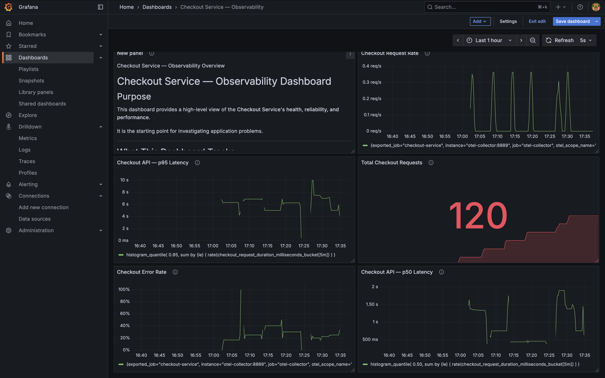

# Observability Demo — Traces, Metrics & Logs with OpenTelemetry

A small Express checkout service instrumented with OpenTelemetry, wired to a
full local observability stack: **Tempo** (traces), **Prometheus** (metrics),
**Loki** (logs) and **Grafana** (visualisation), with an **OpenTelemetry
Collector** in the middle.

All three signals carry the same `trace_id`, so a slow checkout can be followed
from a metric spike, into the trace, down to the individual log lines.

---

## Demo



A Grafana dashboard over the metrics this service emits — request rate, total
requests, error rate, and p50/p95 checkout latency.

📹 **[Walkthrough recording](docs/grafana-prometheus-opentelemetry.mov)** (25 MB) —
Grafana, Prometheus and OpenTelemetry in action. GitHub cannot play `.mov`
inline, so the link downloads the file.

---

## Architecture

```
                        ┌──────────────────────┐
   checkout-service ───▶│   OTel Collector     │
   (Node, on host)      │   OTLP/HTTP :14318   │
                        └──────────┬───────────┘
                                   │
              traces ──────────────┼──────────────▶  Tempo    :3200
              logs   ──────────────┼──────────────▶  Loki     :3100
              metrics ─────────────┴──▶ :8889 ◀───── Prometheus :9091
                                        (scraped)
                                                       │
                                                       ▼
                                                  Grafana :3001
```

The app sends **all three signals over OTLP** to the collector. Logs are
emitted through the OpenTelemetry Logs API rather than being read from a file
— see [Why OTLP for logs](#why-otlp-for-logs).

---

## Prerequisites

| Tool | Version | Notes |
| --- | --- | --- |
| Node.js | 22.x | |
| pnpm | >= 11.10.0 | **required** — `npm start` fails, see below |
| Docker Desktop | any recent | must be running |

> **Use `pnpm`, not `npm`.** `package.json` declares
> `devEngines.packageManager = pnpm`, so `npm start` exits with
> `EBADDEVENGINES`.

---

## Quick start

```bash
# 1. install dependencies
pnpm install

# 2. start the observability stack
docker compose up -d

# 3. start the application
pnpm start
```

The service listens on **http://localhost:3000**.

Generate some traffic:

```bash
curl -X POST http://localhost:3000/checkout \
  -H 'Content-Type: application/json' \
  -d '{"customerId":"CUST-1","productIds":["P1","P2"],"paymentMethod":"card"}'
```

Payments fail randomly by design (see `src/shared/utils/failure-simulator.js`),
so expect a mix of `200` and `500` — that is what makes the traces and error
logs interesting.

---

## URLs

| Service | URL | Notes |
| --- | --- | --- |
| Application | http://localhost:3000 | |
| **Grafana** | **http://localhost:3001** | login `admin` / `admin`; datasources pre-provisioned |
| Prometheus | http://localhost:9091 | **not** 9090 |
| Tempo | http://localhost:3200 | queried via Grafana |
| Loki | http://localhost:3100 | queried via Grafana |
| Collector OTLP | http://localhost:14318 | **not** 4318 |
| Collector metrics | http://localhost:8889/metrics | Prometheus scrape target |

Two ports commonly trip people up:

- **Prometheus is on `9091`**, because `9090` is often taken by another local
  stack. Inside the Docker network it is still `9090`.
- **The collector's OTLP endpoint is `14318`**, because Tempo owns `4318` on
  the host.

---

## API

| Method | Path | Description |
| --- | --- | --- |
| `GET` | `/` | health check |
| `GET` | `/welcome` | welcome message |
| `GET` | `/products` | list products |
| `POST` | `/checkout` | run a checkout (emits traces, metrics, logs) |

`POST /checkout` body:

```json
{
  "customerId": "CUST-1",
  "productIds": ["P1", "P2"],
  "paymentMethod": "card"
}
```

All three fields are required; a missing field returns `500`.

---

## Viewing the signals in Grafana

Open http://localhost:3001 and use **Explore**.

### Logs (Loki)

```logql
{service="checkout-service"}
```

Filter to failures only:

```logql
{service="checkout-service"} | severity_text="ERROR"
```

> **Do not add `| json`.** The collector already parses the record — the log
> body is the plain message, and `level`, `traceId`, `latency` etc. arrive as
> structured metadata. A `| json` stage tries to parse
> `Payment processed successfully.` as JSON and produces
> `__error__=JSONParserErr` on every line.

### Traces (Tempo)

Search by service name `checkout-service`, or paste a `trace_id` taken from any
log line. Each checkout produces `Fetch Products`, `Process Payment` and
`Save Order` spans.

### Metrics (Prometheus)

```promql
checkout_requests_total
checkout_errors_total
checkout_request_duration_milliseconds_count

# p95 checkout latency
histogram_quantile(0.95,
  sum by (le) (rate(checkout_request_duration_milliseconds_bucket[1m])))
```

> **Metric names carry their unit.** The histogram is declared in
> `src/platform/observability/metrics/metrics.js` as `checkout_request_duration`
> with `unit: "ms"`, and the Prometheus exporter appends the unit — so the real
> series is `checkout_request_duration_**milliseconds**_count`. Querying
> `checkout_request_duration_count` returns nothing.

---

## Project layout

```
src/
  app.js                                  Express bootstrap
  routes.js                               route registration
  features/
    checkout/                             checkout flow (orchestrator + payment + db)
    products/  health/  welcome/
  platform/observability/
    telemetry.js                          OTel SDK bootstrap (traces, metrics, logs)
    logging/logger.js                     pino -> file + OTLP
    metrics/metrics.js                    custom counters & histogram
    tracing/tracing.js                    withSpan() helper
infrastructure/
  otel-collector/config.yaml              receivers, processors, exporters
  loki/loki-config.yaml                   Loki + OTLP label config
  prometheus/prometheus.yml               scrape config
  grafana/provisioning/datasources/       Tempo, Loki, Prometheus datasources
  tempo/tempo.yaml
```

`telemetry.js` must be loaded **before** the app — the `start` script does this
with `node --import ./src/platform/observability/telemetry.js src/app.js`.

---

## Configuration

`.env` is git-ignored. Copy the template to get started:

```bash
cp .env.example .env
```

Every value in it is also a built-in default, so the app runs against the
docker compose stack even with no `.env` at all.

Set in `.env`:

| Variable | Value | Purpose |
| --- | --- | --- |
| `PORT` | `3000` | HTTP port |
| `NODE_ENV` | `development` | |
| `APPLICATION_NAME` | `observability-demo` | `service.name`; **`pnpm start` overrides it to `checkout-service`** |
| `APPLICATION_VERSION` | `1.0.0` | |
| `OTEL_EXPORTER_OTLP_ENDPOINT` | `http://localhost:14318` | collector OTLP endpoint |

Read by the code but not set in `.env`:

| Variable | Default | Purpose |
| --- | --- | --- |
| `LOG_LEVEL` | `info` | pino level |
| `OTEL_LOG_LEVEL` | — | set to `debug` to troubleshoot the OTel SDK itself |

> Running `node src/app.js` directly (instead of `pnpm start`) leaves
> `APPLICATION_NAME` as `observability-demo`, and the Grafana queries above —
> which filter on `checkout-service` — will return nothing.

---

## Why OTLP for logs

Logs are sent **directly to the collector over OTLP**. The app still writes
`logs/application.log` for local inspection, but nothing reads that file.

An earlier version had the collector's `filelog` receiver tail the log file
through a Docker bind mount. On macOS that proved unreliable: the collector's
long-held file handle would stop noticing appends, and logs stalled for up to
50 minutes before arriving in one burst. Exporting over OTLP removes the file
from the path entirely — and also removed the `file_storage` checkpoint
extension, a `user: "0:0"` workaround, and most of the collector's OTTL
transform, since severity and trace context now arrive correctly on their own.

---

## Troubleshooting

**`npm start` fails with `EBADDEVENGINES`**
Use `pnpm start`.

**No logs in Grafana**
Check the time range first — only data ingested since the last restart is
present. Then confirm the query has no `| json` stage, and that the app was
started with `pnpm start` so `service.name` is `checkout-service`.

**No metrics at `:8889/metrics`**
The collector only exposes metrics it has received. Make some checkout requests
first; metrics are exported every 5s and scraped every 5s.

**Prometheus shows no `otel-collector` target**
Make sure you are on **http://localhost:9091**, not `9090`.

**Port conflict on startup**
```
Conflict. The container name "/prometheus" is already in use
```
Another compose project owns that name or port. This project uses
`observability-prometheus` and host port `9091` to avoid it — if you still
clash, stop the other stack.

**Reset all data**

```bash
docker compose down          # keeps images, drops container state
: > logs/application.log     # clear the local log file
docker compose up -d
```

Loki stores data in the container layer, so `down` gives a clean slate. Give
Loki ~15s after start before it accepts writes.

---

## Stopping

```bash
# stop the app with Ctrl-C, then
docker compose stop     # keep state
docker compose down     # remove containers and data
```
